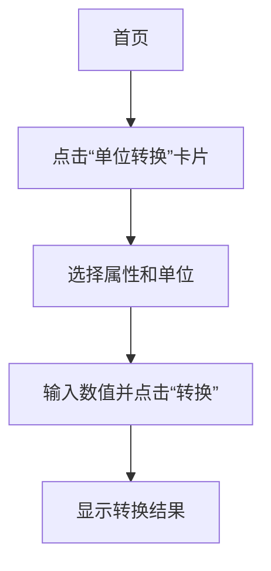
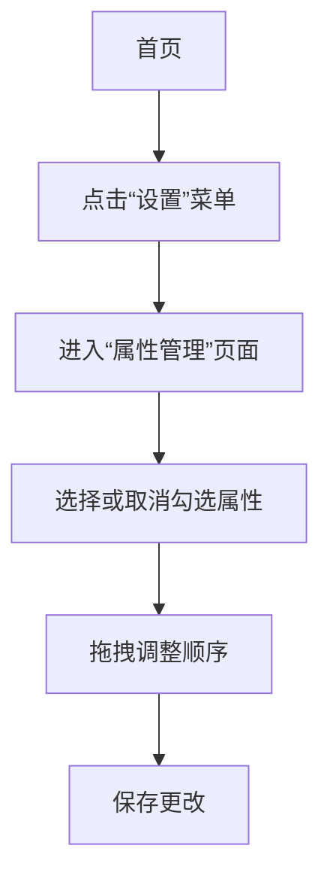
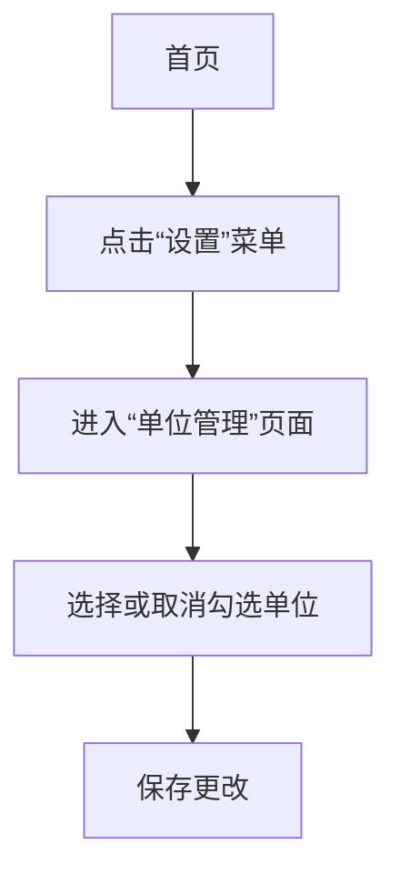
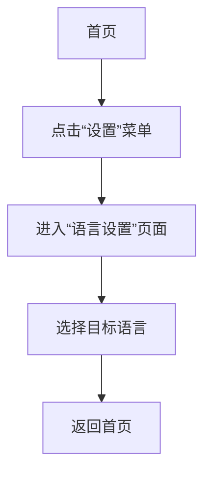
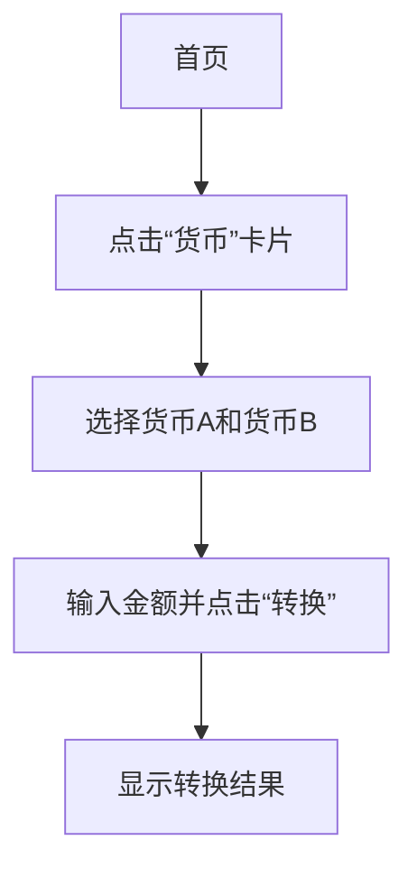
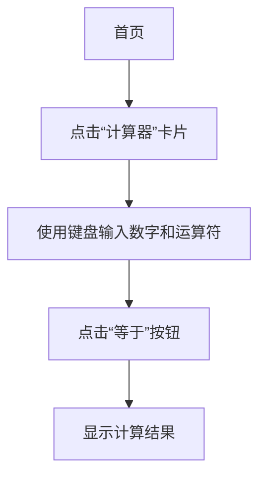
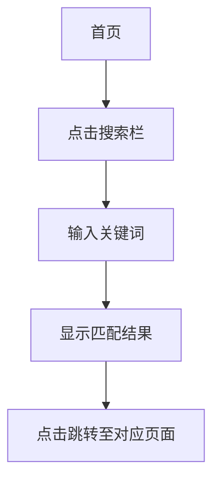
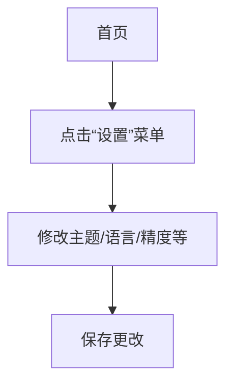

# 用户视角功能与测试场景

# 应用功能说明与测试需求文档

---

## 1. 从用户视角的功能总览

| 功能名称 | 典型用户目标 | 主要使用入口 |
|----------|----------------|----------------|
| 单位转换器 | 快速在不同单位之间进行数值换算，如米转英尺、升转加仑等 | 首页卡片 |
| 属性选择与排序 | 自定义显示哪些单位属性（如长度、重量、温度等）以及它们的显示顺序 | 首页“设置”菜单或“属性管理”页面 |
| 单位选择与隐藏 | 选择需要显示的单位，并隐藏不需要的单位 | “单位管理”页面 |
| 多语言支持 | 使用不同语言界面操作应用 | 设置页面 - 语言选项 |
| 货币汇率换算 | 实时查看并转换多种货币金额 | 首页“货币”卡片 |
| 计算器工具 | 进行数学运算，如加减乘除、科学计算等 | 首页“计算器”卡片 |
| 搜索功能 | 快速查找特定单位或属性 | 搜索栏或首页“搜索”按钮 |
| 系统设置 | 更改主题、语言、精度等个性化设置 | 侧边栏“设置” |

---

## 2. 面向需求的功能说明

### 功能一：单位转换器

**用户视角描述：**  
用户希望在日常生活中快速将一个单位的数值转换为另一个单位的数值，例如将公里转换成英里，或将公斤转换成磅。他们可以在应用中选择对应的单位属性和具体单位，输入数值后立即得到转换结果。

**典型使用场景举例：**

- 当我在旅行中需要知道当前的温度是多少华氏度时，我希望可以快速在摄氏度和华氏度之间切换。
- 当我做饭时，想把食谱中的克数转换成盎司，以便更准确地称量食材。
- 当我学习物理时，希望可以将牛顿转换成磅力，以适应不同的教材要求。

**功能边界与限制：**

- 支持的单位类型由系统预设，用户无法自行添加新的单位类型。
- 转换结果会根据设备的网络连接情况更新实时汇率（如货币）。
- 仅支持已配置的单位之间的转换。

**验收标准提示：**

- 用户能够通过选择属性和单位，输入数值后看到正确的转换结果。
- 在无网络环境下，货币转换功能应能基于本地缓存数据运行。
- 所有单位转换结果应显示清晰，且支持小数点位数自定义。

---

### 功能二：属性选择与排序

**用户视角描述：**  
用户希望可以根据自己的需求，自由选择哪些单位属性（如长度、重量、温度等）在应用中显示，并调整它们的显示顺序，以便更高效地找到常用功能。

**典型使用场景举例：**

- 当我主要关注的是长度和体积单位时，我希望可以隐藏其他不常用的属性。
- 当我在做工程设计时，希望将“压力”和“速度”放在最前面，方便快速访问。
- 当我在教学过程中，希望按课程内容顺序排列单位属性，提高学生的学习效率。

**功能边界与限制：**

- 不能删除或禁用所有单位属性，至少保留一种属性用于显示。
- 排序操作需在“属性管理”页面中完成，无法在首页直接拖动排序。

**验收标准提示：**

- 用户能够进入“属性管理”页面并看到可选的属性列表。
- 用户可以通过拖拽或点击按钮对属性进行排序。
- 页面刷新后，排序结果应保持不变。

---

### 功能三：单位选择与隐藏

**用户视角描述：**  
用户希望可以根据自己的使用习惯，选择显示哪些单位（如米、千米、英里等），并隐藏不需要的单位，使界面更加简洁和高效。

**典型使用场景举例：**

- 当我只需要使用公制单位时，我希望可以隐藏英制单位。
- 当我在处理建筑项目时，希望只显示与工程相关的单位，避免干扰。
- 当我在学习某个特定领域时，希望只显示该领域的相关单位。

**功能边界与限制：**

- 不能隐藏所有单位，必须至少保留一个单位可供使用。
- 隐藏的单位仍然可在“单位管理”页面中恢复显示。

**验收标准提示：**

- 用户能够进入“单位管理”页面并看到可选的单位列表。
- 用户可以通过开关或点击操作来隐藏或显示单位。
- 隐藏的单位在转换页面中不再出现。

---

### 功能四：多语言支持

**用户视角描述：**  
用户希望应用界面可以切换为不同语言，以满足个人语言偏好或国际交流的需求。

**典型使用场景举例：**

- 当我与来自其他国家的朋友交流时，我希望可以将应用界面切换为他们的语言。
- 当我在海外旅行时，希望使用当地语言界面来更好地理解应用内容。
- 当我正在学习一门新语言时，希望通过应用界面练习阅读和理解能力。

**功能边界与限制：**

- 不支持自定义语言翻译，只能在预设的语言包中选择。
- 切换语言后，部分界面可能需要重新加载才能生效。

**验收标准提示：**

- 用户能够在“设置”中选择不同的语言。
- 界面元素（如按钮、标题、提示文字）应正确显示所选语言。
- 切换语言后，应用仍能正常运行。

---

### 功能五：货币汇率换算

**用户视角描述：**  
用户希望在应用中查看并转换多种货币的金额，例如将人民币转换为美元、欧元等，以便于国际交易或旅行准备。

**典型使用场景举例：**

- 当我计划去国外旅行时，希望了解当前汇率，以便规划预算。
- 当我收到国外客户的付款时，希望确认实际到账金额。
- 当我在网上购物时，希望将商品价格转换为本国货币，便于比较。

**功能边界与限制：**

- 货币汇率数据依赖于网络连接，若无网络则可能无法获取最新数据。
- 仅支持预设的货币种类，无法自定义新增货币。

**验收标准提示：**

- 用户能够进入“货币”页面并看到支持的货币列表。
- 输入金额后，应用应显示对应货币的转换结果。
- 若网络中断，应用应显示缓存数据或提示错误信息。

---

### 功能六：计算器工具

**用户视角描述：**  
用户希望有一个独立的计算器工具，用于执行基本的数学运算、科学计算或快捷计算，提升工作效率。

**典型使用场景举例：**

- 当我需要快速计算一组数字的总和时，我希望使用计算器功能。
- 当我在处理复杂公式时，希望使用科学计算模式进行运算。
- 当我在做财务分析时，希望使用计算器来验证数据。

**功能边界与限制：**

- 仅支持基础的数学运算和科学函数，不支持自定义脚本。
- 计算器功能为独立组件，不可嵌入到其他页面中。

**验收标准提示：**

- 用户能够进入“计算器”页面并看到完整的键盘布局。
- 输入数字和运算符后，计算器应正确显示结果。
- 键盘事件和手势操作应响应流畅。

---

### 功能七：搜索功能

**用户视角描述：**  
用户希望在应用中快速查找特定的单位、属性或功能，无需逐个浏览页面。

**典型使用场景举例：**

- 当我想查找“毫米”这个单位时，我希望可以直接搜索到它。
- 当我需要找到“温度”相关的转换功能时，希望能在搜索栏中输入关键词快速定位。
- 当我不记得某个单位的具体名称时，希望可以用模糊关键词找到它。

**功能边界与限制：**

- 搜索功能仅限于单位和属性名称，不支持全文搜索。
- 搜索结果会根据输入内容动态展示。

**验收标准提示：**

- 用户能够在搜索栏中输入关键词并看到匹配的结果。
- 搜索结果应包含单位、属性名称及对应的转换页面链接。
- 搜索功能响应速度快，不卡顿。

---

### 功能八：系统设置

**用户视角描述：**  
用户希望根据个人喜好调整应用的外观和行为，如更改主题颜色、语言、显示精度等。

**典型使用场景举例：**

- 当我长时间使用应用时，希望切换为深色模式以保护眼睛。
- 当我与家人一起使用应用时，希望将语言切换为他们的母语。
- 当我进行精密测量时，希望显示更多小数位数以提高准确性。

**功能边界与限制：**

- 不支持自定义主题颜色，只能在预设主题中选择。
- 某些设置可能需要重启应用才能生效。

**验收标准提示：**

- 用户能够进入“设置”页面并看到可调整的选项。
- 修改设置后，应用界面应立即反映变化。
- 所有设置项应有明确的说明，防止误操作。

---

## 3. 测试需求分析

### 整体测试范围

- **核心功能**：单位转换、货币换算、属性管理、单位管理、搜索功能、计算器、多语言支持。
- **平台覆盖**：iOS、Android、Web（如适用）。
- **语言支持**：英语、中文、法语、西班牙语等预设语言。
- **单位类型**：长度、重量、温度、货币等预设单位。

### 测试维度

- **正向流程**：用户正常使用功能时的路径是否顺畅。
- **边界输入**：如超大数值、负数、非数字字符等。
- **异常输入**：无效单位、未授权操作等。
- **错误提示**：当用户操作出错时，系统是否给出明确提示。
- **国际化**：不同语言下的界面显示是否一致、无乱码。
- **多设备/分辨率**：在不同屏幕尺寸下，界面是否适配良好。

### 风险点与优先级

| 功能 | 风险等级 | 说明 |
|------|-----------|------|
| 单位转换 | 高 | 核心功能，影响用户体验 |
| 货币换算 | 高 | 依赖网络，失败成本高 |
| 多语言支持 | 中 | 影响国际化用户的使用体验 |
| 计算器 | 中 | 基础功能，但易被忽略 |
| 搜索功能 | 中 | 提升效率的关键，但实现较复杂 |

---

## 4. 测试场景列表

### 功能一：单位转换器

| 场景ID | 所属功能 | 场景名称 | 前置条件 | 步骤 | 预期结果 |
|--------|----------|----------|----------|------|----------|
| T001 | 单位转换器 | 正常单位转换 | 已选择“长度”属性 | 1. 打开首页 2. 点击“单位转换”卡片 3. 选择“米”和“英尺” 4. 输入“5” 5. 点击“转换” | 1. 显示“米 → 英尺”页面 2. 输入框显示“5” 3. 结果显示“16.404 英尺” |
| T002 | 单位转换器 | 边界值转换 | 已选择“温度”属性 | 1. 打开首页 2. 点击“单位转换”卡片 3. 选择“摄氏度”和“华氏度” 4. 输入“-273.15” 5. 点击“转换” | 1. 显示“摄氏度 → 华氏度”页面 2. 输入框显示“-273.15” 3. 结果显示“-459.67 华氏度” |
| T003 | 单位转换器 | 无效输入检测 | 已选择“长度”属性 | 1. 打开首页 2. 点击“单位转换”卡片 3. 选择“米”和“英尺” 4. 输入“abc” 5. 点击“转换” | 1. 显示错误提示“请输入有效数字” 2. 输入框内容保持为空 |

---

### 功能二：属性选择与排序

| 场景ID | 所属功能 | 场景名称 | 前置条件 | 步骤 | 预期结果 |
|--------|----------|----------|----------|------|----------|
| T004 | 属性选择与排序 | 选择多个属性 | 无 | 1. 打开首页 2. 点击“设置”菜单 3. 进入“属性管理”页面 4. 勾选“长度”、“重量”、“温度” 5. 保存更改 | 1. 返回首页 2. 看到“长度”、“重量”、“温度”三个卡片 |
| T005 | 属性选择与排序 | 拖拽排序 | 无 | 1. 打开首页 2. 点击“设置”菜单 3. 进入“属性管理”页面 4. 拖动“温度”到顶部 5. 保存更改 | 1. 返回首页 2. “温度”卡片显示在最上方 |

---

### 功能三：单位选择与隐藏

| 场景ID | 所属功能 | 场景名称 | 前置条件 | 步骤 | 预期结果 |
|--------|----------|----------|----------|------|----------|
| T006 | 单位选择与隐藏 | 隐藏单位 | 无 | 1. 打开首页 2. 点击“设置”菜单 3. 进入“单位管理”页面 4. 关闭“英寸”单位 5. 保存更改 | 1. 返回首页 2. “英寸”不在任何转换页面中显示 |
| T007 | 单位选择与隐藏 | 恢复隐藏单位 | 无 | 1. 打开首页 2. 点击“设置”菜单 3. 进入“单位管理”页面 4. 开启“英寸”单位 5. 保存更改 | 1. 返回首页 2. “英寸”出现在转换页面中 |

---

### 功能四：多语言支持

| 场景ID | 所属功能 | 场景名称 | 前置条件 | 步骤 | 预期结果 |
|--------|----------|----------|----------|------|----------|
| T008 | 多语言支持 | 切换语言 | 无 | 1. 打开首页 2. 点击“设置”菜单 3. 进入“语言设置”页面 4. 选择“英语” 5. 保存更改 | 1. 返回首页 2. 所有界面文字变为英文 |
| T009 | 多语言支持 | 语言切换后刷新 | 无 | 1. 打开首页 2. 点击“设置”菜单 3. 进入“语言设置”页面 4. 选择“中文” 5. 保存更改 | 1. 返回首页 2. 界面文字变为中文 |

---

### 功能五：货币汇率换算

| 场景ID | 所属功能 | 场景名称 | 前置条件 | 步骤 | 预期结果 |
|--------|----------|----------|----------|------|----------|
| T010 | 货币汇率换算 | 正常货币转换 | 无 | 1. 打开首页 2. 点击“货币”卡片 3. 选择“人民币”和“美元” 4. 输入“100” 5. 点击“转换” | 1. 显示“人民币 → 美元”页面 2. 输入框显示“100” 3. 结果显示“14.3 美元” |
| T011 | 货币汇率换算 | 网络断开时的处理 | 无 | 1. 打开首页 2. 点击“货币”卡片 3. 选择“人民币”和“美元” 4. 断开网络 5. 输入“100” 6. 点击“转换” | 1. 显示“网络不可用”提示 2. 无法获得实时汇率 |

---

### 功能六：计算器工具

| 场景ID | 所属功能 | 场景名称 | 前置条件 | 步骤 | 预期结果 |
|--------|----------|----------|----------|------|----------|
| T012 | 计算器工具 | 基本运算 | 无 | 1. 打开首页 2. 点击“计算器”卡片 3. 输入“5+5” 4. 点击“=” | 1. 显示“10” |
| T013 | 计算器工具 | 科学计算 | 无 | 1. 打开首页 2. 点击“计算器”卡片 3. 输入“sin(30)” 4. 点击“=” | 1. 显示“0.5” |

---

### 功能七：搜索功能

| 场景ID | 所属功能 | 场景名称 | 前置条件 | 步骤 | 预期结果 |
|--------|----------|----------|----------|------|----------|
| T014 | 搜索功能 | 按单位搜索 | 无 | 1. 打开首页 2. 点击搜索栏 3. 输入“米” 4. 查看搜索结果 | 1. 显示“米”相关单位和属性 |
| T015 | 搜索功能 | 按属性搜索 | 无 | 1. 打开首页 2. 点击搜索栏 3. 输入“温度” 4. 查看搜索结果 | 1. 显示“温度”相关单位和页面 |

---

### 功能八：系统设置

| 场景ID | 所属功能 | 场景名称 | 前置条件 | 步骤 | 预期结果 |
|--------|----------|----------|----------|------|----------|
| T016 | 系统设置 | 更改主题 | 无 | 1. 打开首页 2. 点击“设置”菜单 3. 进入“主题设置” 4. 选择“深色模式” 5. 保存更改 | 1. 返回首页 2. 应用界面变为深色主题 |
| T017 | 系统设置 | 更改语言 | 无 | 1. 打开首页 2. 点击“设置”菜单 3. 进入“语言设置” 4. 选择“法语” 5. 保存更改 | 1. 返回首页 2. 界面文字变为法语 |

--- 

以上为完整功能说明与测试场景设计文档，适用于开发、测试及产品团队协作推进项目落地。